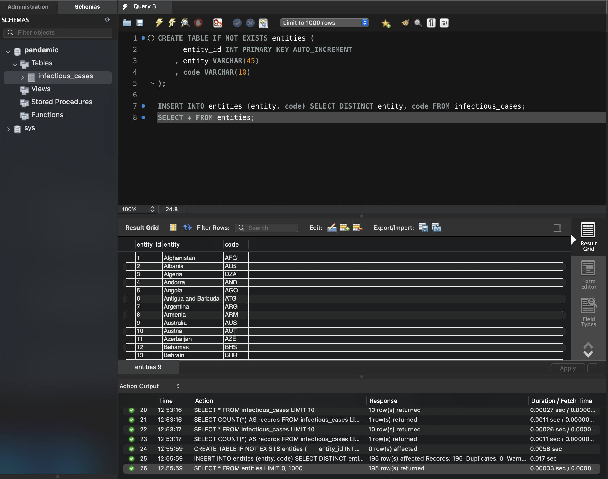
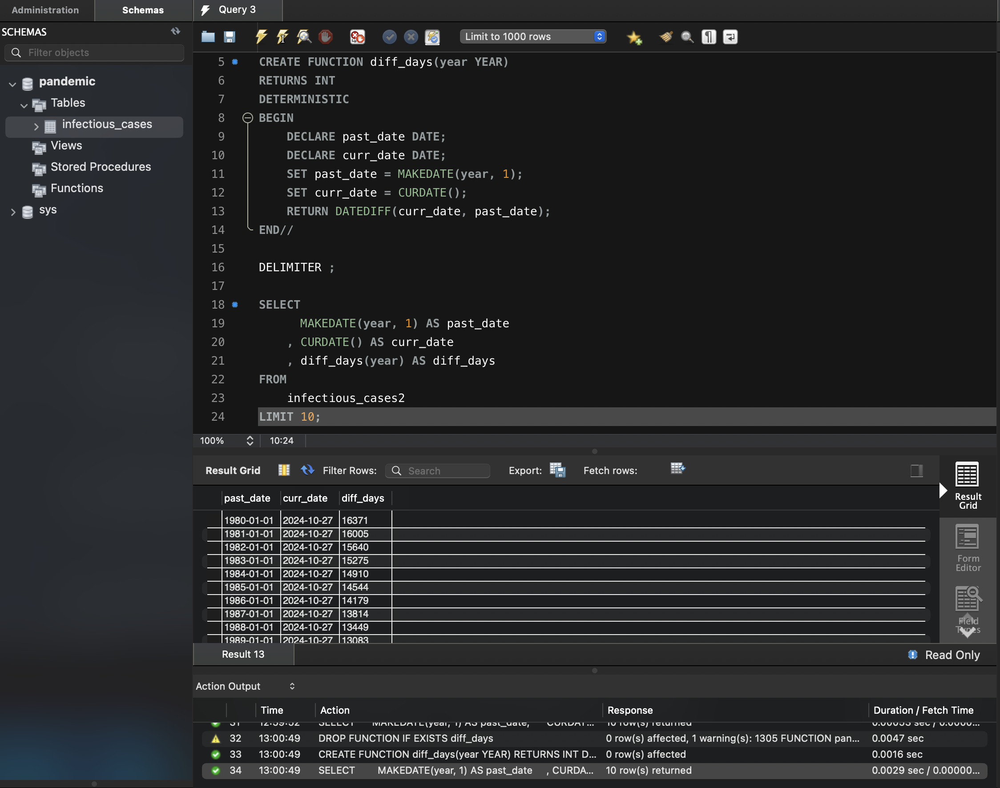

# Tasks

### task-01 
Завантажте дані:

* Створіть схему `pandemic` у базі даних за допомогою SQL-команди.
* Оберіть її як схему за замовчуванням за допомогою SQL-команди.
* Імпортуйте дані за допомогою Import wizard так, як ви вже робили це у темі 3.
* Продивіться дані, щоб бути у контексті.

```sql
CREATE SCHEMA IF NOT EXISTS pandemic;

USE pandemic;

SELECT * FROM infectious_cases LIMIT 10;
SELECT COUNT(*) AS records FROM infectious_cases;
```

Результат виконання:


### task-02 
Нормалізуйте таблицю infectious\_cases до 3ї нормальної форми. Збережіть у цій же схемі дві таблиці з нормалізованими даними.

```sql
CREATE TABLE IF NOT EXISTS entities (
      entity_id INT PRIMARY KEY AUTO_INCREMENT
    , entity VARCHAR(45)
    , code VARCHAR(10)
);

INSERT INTO entities (entity, code) SELECT DISTINCT entity, code FROM infectious_cases;
SELECT * FROM entities;

CREATE TABLE infectious_cases2 (
      case_id INT PRIMARY KEY AUTO_INCREMENT
    , entity_id INT
    , year YEAR
    , number_yaws TEXT
    , polio_cases TEXT
    , cases_guinea_worm TEXT
    , number_rabies TEXT
    , number_malaria TEXT
    , number_hiv TEXT
    , number_tuberculosis TEXT
    , number_smallpox TEXT
    , number_cholera_cases TEXT
    , FOREIGN KEY (entity_id) REFERENCES entities(entity_id)
);

INSERT INTO infectious_cases2 (
      entity_id
    , year
    , number_yaws
    , polio_cases
    , cases_guinea_worm
    , number_rabies
    , number_malaria
    , number_hiv
    , number_tuberculosis
    , number_smallpox
    , number_cholera_cases
)
SELECT 
      e.entity_id
    , ico.year
    , ico.number_yaws
    , ico.polio_cases
    , ico.cases_guinea_worm
    , ico.number_rabies
    , ico.number_malaria
    , ico.number_hiv
    , ico.number_tuberculosis
    , ico.number_smallpox
    , ico.number_cholera_cases
FROM infectious_cases ico
JOIN entities e ON ico.entity = e.entity AND ico.code = e.code;

SELECT * FROM infectious_cases2 LIMIT 10;
```

Результат виконання:




### task-03 
Проаналізуйте дані:

* Для кожної унікальної комбінації `Entity` та `Code` або їх `id` порахуйте середнє, мінімальне, максимальне значення та суму для атрибута `Number_rabies`.
* Результат відсортуйте за порахованим середнім значенням у порядку спадання.
* Оберіть тільки 10 рядків для виведення на екран.

```sql
SELECT e.entity, e.code, 
    AVG(ic.number_rabies) AS avg_rabies, 
    MIN(ic.number_rabies) AS min_rabies, 
    MAX(ic.number_rabies) AS max_rabies, 
    SUM(ic.number_rabies) AS sum_rabies
FROM infectious_cases2 ic
    JOIN entities e ON ic.entity_id = e.entity_id
    WHERE ic.number_rabies NOT IN ('')
    GROUP BY e.entity, e.code
LIMIT 10;
```

Результат виконання:


### task-04 
Побудуйте колонку різниці в роках.

Для оригінальної або нормованої таблиці для колонки `Year` побудуйте з використанням вбудованих SQL-функцій:

* атрибут, що створює дату першого січня відповідного року
* атрибут, що дорівнює поточній даті
* атрибут, що дорівнює різниці в роках двох вищезгаданих колонок

```sql
SELECT 
    MAKEDATE(year, 1) AS past_date, 
    CURDATE() AS curr_date, 
    DATEDIFF(CURDATE(), MAKEDATE(year, 1)) AS diff_days
FROM
    infectious_cases2
LIMIT 10;
```

Результат виконання:


### task-05 
Побудуйте власну функцію.

* Створіть і використайте функцію, що будує такий же атрибут, як і в попередньому завданні: функція має приймати на вхід значення року, а повертати різницю в роках між поточною датою та датою, створеною з атрибута року (1996 рік → '1996-01-01').

```sql
DROP FUNCTION IF EXISTS diff_days;

DELIMITER //

CREATE FUNCTION diff_days(year YEAR)
RETURNS INT
DETERMINISTIC
BEGIN
	DECLARE past_date DATE;
    DECLARE curr_date DATE;
    SET past_date = MAKEDATE(year, 1);
	SET curr_date = CURDATE();
    RETURN DATEDIFF(curr_date, past_date);
END//

DELIMITER ;

SELECT 
      MAKEDATE(year, 1) AS past_date
    , CURDATE() AS curr_date
    , diff_days(year) AS diff_days
FROM
    infectious_cases2
LIMIT 10;
```

Результат виконання:

